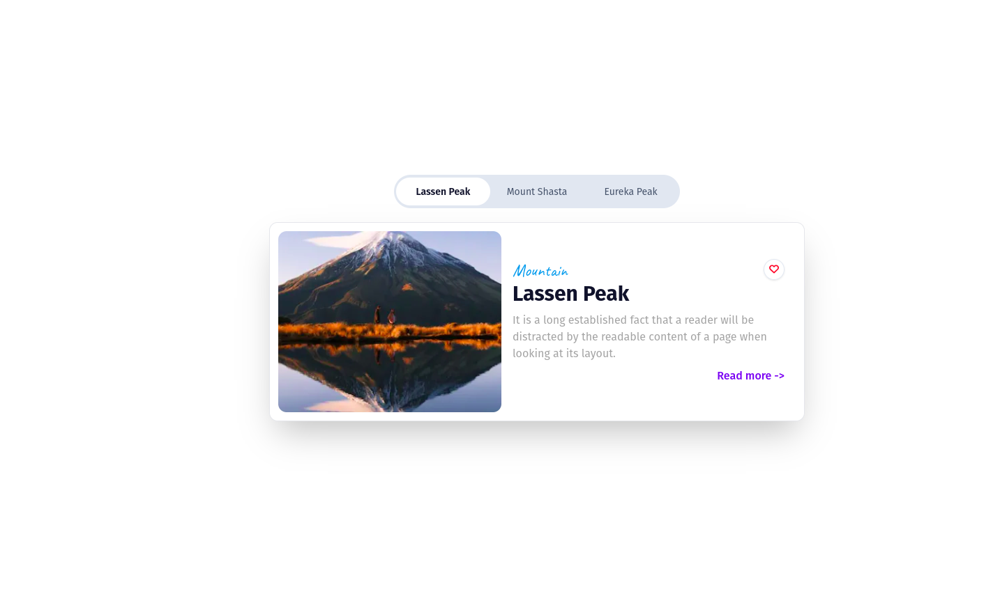

<div align="center">

  
  <h1>Hoppscotch Assignment</h1>
  
  <p>
  Hoppscotch internship task
  </p>
  
  
   
<h4>
    <a href="https://hoppscotch-assignment.vercel.app/">View Demo</a>
  <span>
</div>

<br />

<!-- Screenshots -->

<div align="center"> 
  
</div>


<!-- About the Project -->

## About the Project

This project is part of an internship task from Hoppscotch, where the goal is to create a tab switcher component using Vue.js and Tailwind CSS. The tab switcher should allow users to navigate between different tabs, each displaying a card with specific information.

## Task Requirments
1. Implement a tab switcher component using Vue.js.
2. Each tab should display a card with specific information.
3. Use Tailwind CSS for styling the components.
4. Make the project structure clean and organized.

## Project Components 

1. **Tab Switcher Component (TabSwitcher.vue):**
  - Responsible for rendering the tab buttons and managing tab selection.
  - Utilizes Vue.js reactivity to update the selected tab.
  - Employs Tailwind CSS for styling the tab buttons.
2. **Card Component (Card.vue):**
 - Displays detailed information within a card.
 - Receives data from the selected tab and renders accordingly.
 - Styled using Tailwind CSS classes to achieve a clean and modern look.
3. **Main App Component (App.vue):**
 - Integrates the TabSwitcher and Card components.
 - Manages the data for tabs and the currently selected tab.
 - Implements transition effects for smooth tab switching.


## Project Structure:
1. **components/:** Contains Vue.js components (TabSwitcher.vue, Card.vue).
2. **assets/:** Stores any necessary assets like images or fonts.
3. **App.vue:** Main component integrating TabSwitcher and Card components.
4. **main.ts:** Entry point for Vue.js application.
5. **tailwind.config.js:** Configuration file for Tailwind CSS.
6. **package.json:** Manages project dependencies and scripts.

## Technologies Used:
1. **Vue.js:** A progressive JavaScript framework for building user interfaces.
2. **Tailwind CSS:** A utility-first CSS framework for quickly building custom designs.
3. **JavaScript:** Programming language used for interactivity and logic.
4. **HTML/CSS:** Markup and styling languages for structuring and presenting the UI.


## Run Locally

Clone the project

```bash
  git clone https://github.com/MunavvarSinan/hoppscotch-assignment
```

Go to the project directory

```bash
  cd hoppscotch-assignment
```

Install dependencies

```bash
  pnpm install
```

Start the dev server

```bash
  pnpm dev
```

## Conclusion:
This project aims to demonstrate proficiency in Vue.js and Tailwind CSS by implementing a tab switcher component with smooth transitions and clean, modern UI design. It showcases the ability to organize components, manage state, and apply styling effectively to create a functional and visually appealing user interface.
